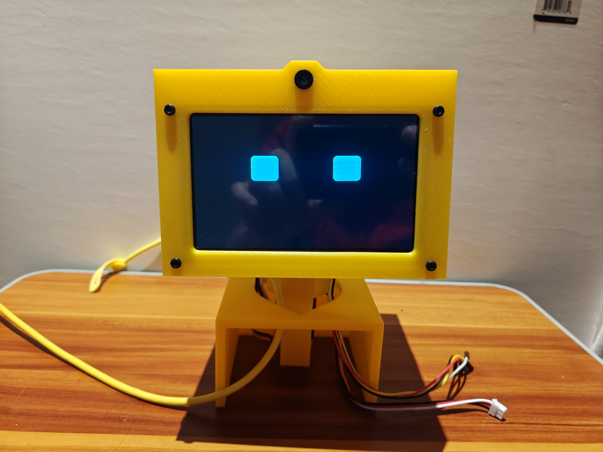
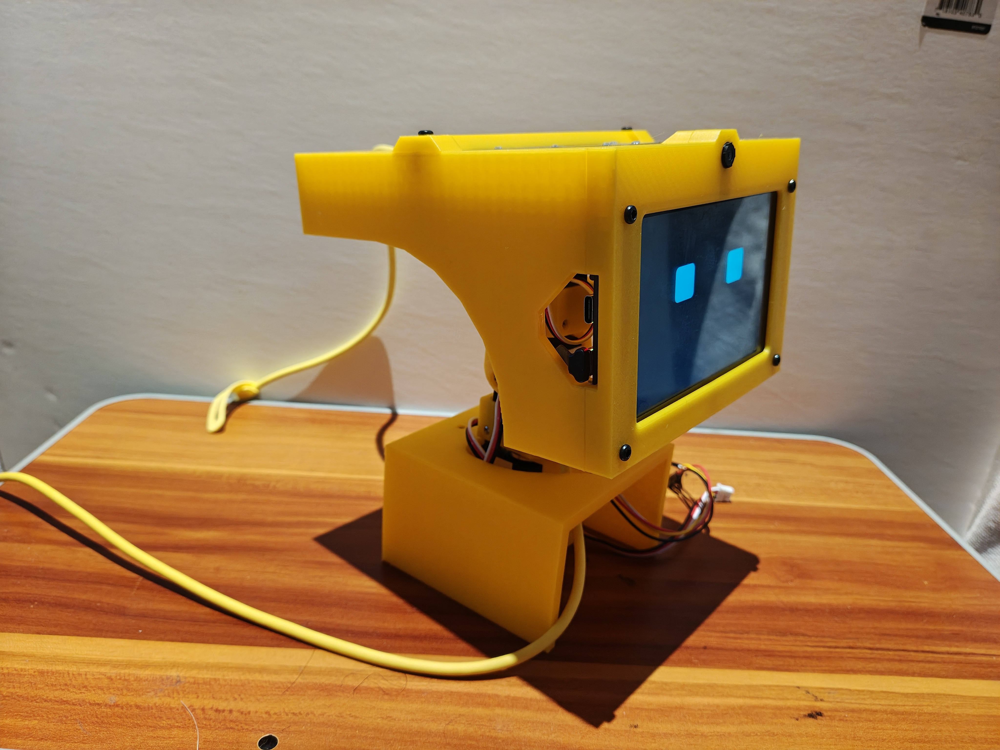
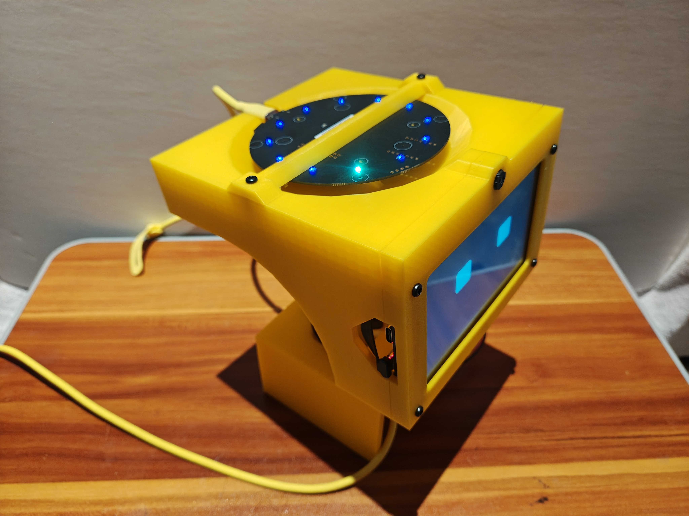

# Bubo

**Bubo is a wearable shoulder robot combining computer vision, expressive animation, robotics, speech, and local AI.**

The shoulder unit uses an ESP32-P4 for low-latency tasks such as camera processing, face tracking, display animation, and actuator control. A backpack-mounted Jetson Orin Nano Super will handle speech recognition, local LLM inference, text-to-speech, and higher-level behavior.

> **Status:** Active prototype. The physical head/shoulder assembly, ESP32-P4 display, camera pipeline, face detection, eye animation, and USB communication framework are working.



## Current Status

### Working

- ESP32-P4 display and camera
- On-device face detection using ESP-DL
- Face tracking and smoothing
- LVGL eye animation
- USB CDC communication framework
- Physical head and shoulder prototype

### Next

- Use face position to control gaze
- Servo-driven head movement
- Mouth and expression animation
- Backpack-to-shoulder command protocol
- Directional microphone integration

### Planned

- Speech-to-text
- Local LLM-based character dialogue
- Text-to-speech
- Coordinated speech, gaze, expression, and movement

## Architecture

Bubo splits the workload between the shoulder robot and backpack computer.

The **ESP32-P4** handles real-time interaction with the physical world, while the **Jetson Orin Nano Super** handles the heavier speech and AI workloads.

A reSpeaker XMOS XVF3800 provides voice capture and Direction of Arrival information. The Jetson and ESP32-P4 communicate over USB CDC serial.


## Prototype





## Hardware

| Component | Role |
| --- | --- |
| ESP32-P4 CrowPanel | Display, vision, and shoulder-side control |
| Camera | Face detection and tracking |
| reSpeaker XMOS XVF3800 | Voice capture and speaker direction |
| FEETECH STS3215 servos | Head movement |
| Jetson Orin Nano Super | Speech, LLM, and behavior processing |
| 12 V battery | Portable power |

## Software

**Embedded:** C/C++, ESP-IDF, FreeRTOS, LVGL, ESP-DL, TinyUSB

**Backpack:** Jetson, speech-to-text, local LLM, text-to-speech

The ESP32-P4 firmware currently lives under [`screen/`](screen/).

## About the Name

**Bubo** takes its name from the owl genus *Bubo* and from Bubo, the mechanical owl in the 1981 film *Clash of the Titans*.

Both seemed appropriate for a small robotic companion designed to perch on someone's shoulder.

## Roadmap

The next major milestone is closing the attention loop:

**face detected → target selected → gaze → head movement**

After that, the backpack will add:

**speech → local LLM → response → speech + expression + movement**

Bubo is an active work in progress, and the architecture will continue to evolve as the hardware and software are integrated.
```
